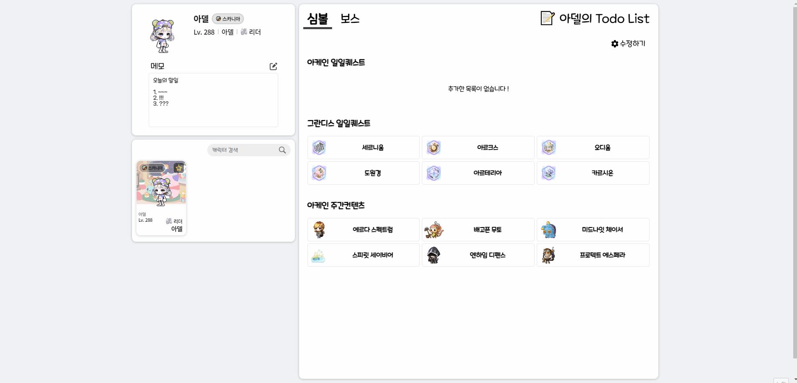
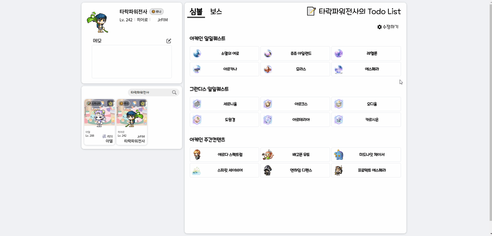
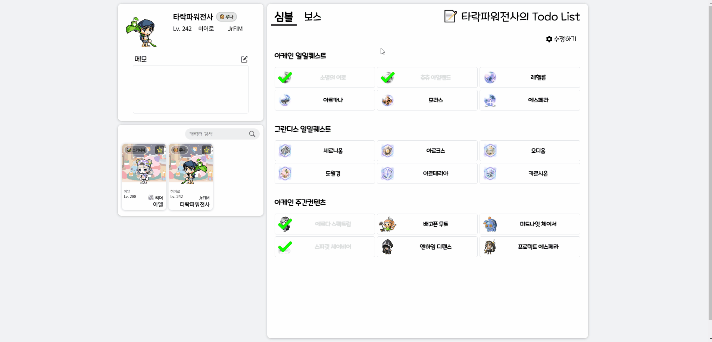
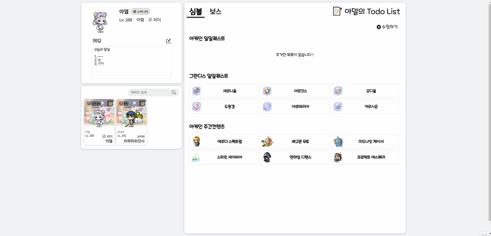

#  메할일 - MapleToDoList

넥슨 게임, 메이플스토리의 할 일을 관리 할 수 있는 To Do App 입니다.  
관리하고 싶은 캐릭터를 `검색 > 즐겨찾기` 를 통해 추가 할 수 있습니다.  
캐릭터 검색 및 캐릭터 카드에 활용할 데이터는 [NEXON OPEN API](https://openapi.nexon.com/game/maplestory/?id=22) 를 활용하고 있습니다.

각 캐릭터는 간단한 메모 작성이 가능한 메모장을 가지고 있습니다.  
`수정하기` 기능을 통해 메모를 수정하고, 저장 할 수 있습니다.

추가한 캐릭터는 심볼, 보스로 구성된 ToDoList를 가집니다.  
ToDoList의 ToDos는 일간, 주간(월), 주간(목), 월간 할 일로 구성되어 있습니다.  
각 ToDos는 정해진 주기마다 초기화되며, `수정하기` 기능을 통해 리스트에서 추가 또는 제거 할 수 있습니다.

## 📌 프로젝트 목표

- Typescript 활용  
  타입선언 및 타입가드를 통해 대상 객체로의 접근을 안전하게 수행합니다.
  Redux에 Typescript를 적용합니다.

- Redux 활용  
  redux-toolkit을 활용해 전역 관리가 필요한 데이터를 관리합니다.  
  전역상태관리를 통해 props의 복잡도를 개선합니다.  
  redux-persist를 활용해 재접속시에도 데이터가 날아가지 않도록 관리합니다.

- Rest API  
  API에 요청해 받아온 정보를 저장하고 활용합니다.

- Styled-Components  
  props 전달을 통해 가변적인 스타일을 적용합니다.

## ⚙ 기술 스택

<!--  -->

  
  

   

 

  
  

  
  
  

## 📄 페이지 구성

<table>
   <tbody>
      <tr>
         <th style="text-align: center">캐릭터 검색 + 결과 모달 + 캐릭터 추가</th>
      </tr>
      <tr>
         <td></td>
      </tr>
      <tr>
         <th style="text-align: center">심볼 투두리스트 체크</th>
      </tr>
      <tr>
         <td></td>
      </tr>
      <tr>
         <th style="text-align: center">로딩 + 보스 투두리스트 체크</th> 
      </tr>
      <tr>
         <td></td>
      </tr>
      <tr>
         <th style="text-align: center">투두리스트 수정</th>
      </tr>
      <tr>
         <td></td>
      </tr>
      <tr>
         <th style="text-align: center">메모장</th>
      </tr>
      <tr>
         <td></td>
      </tr>
   </tbody>
</table>

### 메인 (컨텐츠)

---

- 좌측

1. 캐릭터 정보
   - 현재 선택된 캐릭터의 정보
   - 캐릭터별 간단한 메모
2. 캐릭터 리스트
   - 캐릭터 검색창 : Nexon Open API 를 통해 정보 수집
   - 리스트에 추가된 캐릭터의 카드들

 

- 우측

1. 탭
   - 심볼탭과 보스탭으로 구성 (현재 선택된 탭에 따라 하단의 컨텐츠가 변경됨)
2. 수정 버튼
   - 하단의 컨텐츠를 ToDoList와 리스트 수정으로 토글시켜주는 버튼
3. ToDoList컨텐츠
   1. ToDoList
      - 클릭을 통해 해당 항목의 상태를 완료 또는 미완료로 변경
      - 컨텐츠들은 정해진 주기마다 완료상태가 초기화됨
   2. 리스트 수정하기
      - 클릭을 통해 해당 항목을 ToDoList에 추가 또는 제거

 

### 모달 (검색 정보)

---

- 검색한 캐릭터의 카드 생성 및 노출
- 즐겨찾기를 통해 리스트에 해당 캐릭터 추가 가능

 

### 하단 (기타 정보)

---

- 기타 정보

 

## 📑 Task(Todos)

- 캐릭터 별 Todos

1. 보스 Todos  
   일일, 주간, 월간

2. 심볼 Todos  
   [일일] 아케인리버, 그란디스  
   [주간] 아케인리버

3. 컨텐츠 Todos (추가 예정)  
   [일일] 몬스터파크(일반 & 익스트림)  
   [주간] 하이마운틴, 수로, 무릉도장

## 🛠 Trouble Shooting

[트러블 슈팅 readme.md](https://github.com/bumstop/MapleToDoList/blob/main/trouble-shooting.md)
