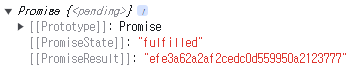

# 개발중 발생한 오류 모음

# SearchBox.tsx

## `useRef`를 사용해 `input` 을 지정했는데 에러가 발생했다.

```
export function SearchBox() {
const searchInputRef = useRef<HTMLInputElement>();

return (
    <>
        <input type="text" placeholder="캐릭터 검색" id="search-input" ref={searchInputRef}/>
    </>
    );
}
```

**`input` 부분의 `ref` 에서 해당 에러 메시지가 발생한다.**

'MutableRefObject<HTMLInputElement | undefined>' 형식은 'LegacyRef<HTMLInputElement> | undefined' 형식에 할당할 수 없습니다.  
'MutableRefObject<HTMLInputElement | undefined>' 형식은 'RefObject<HTMLInputElement>' 형식에 할당할 수 없습니다.  
'current' 속성의 형식이 호환되지 않습니다.  
'HTMLInputElement | undefined' 형식은 'HTMLInputElement | null' 형식에 할당할 수 없습니다.  
'undefined' 형식은 'HTMLInputElement | null' 형식에 할당할 수 없습니다.

**아래와 같이 `useRef` 에 `null` 을 넣어주니 에러가 사라졌다.**

```
const searchInputRef = useRef<HTMLInputElement>(null);
```

## `promise` 객체에서 리턴된 result 값 꺼내기

`getOcid` 는 `promise` 객체를 반환한다.

```
const ocid = getOcid(nickname);
console.log(ocid);
```



<br/>

`getOcid` 앞에 `await` 를 붙인 후 할당해주니 `ocid` 의 값에 PromiseResult의 값이 할당된것을 확인 할 수 있다.

```
const ocid = await getOcid(nickname);
console.log(ocid);
```


