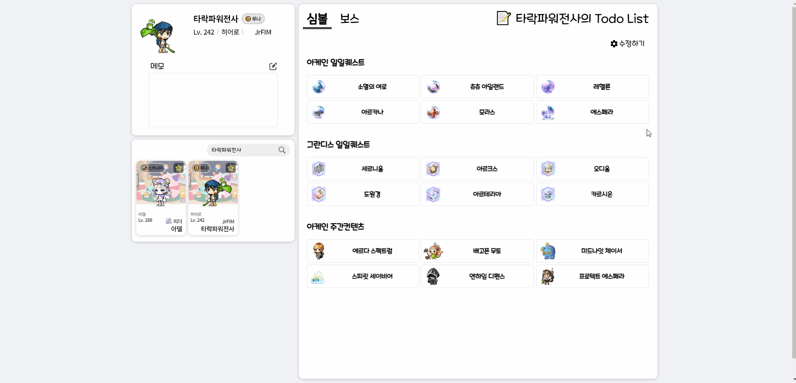

# AS-IS

## 문제상황

`ToDoSymbol` 과 `ToDoBoss` 컴포넌트의 모든 todos를 체크해야 할 때 일일이 체크해야 하는 번거로움이 생겼습니다.



## 만들고 싶은 기능

컨텐츠 카테고리 별로 버튼을 만들어 전체 체크/해제 기능을 하는 토글버튼을 만들어 편의성을 높이고자 했습니다.

<br>

# Challenge

## 1. `AllChecker` 컴포넌트화 및 props 설정

해당 기능을 `ToDoSymbol` 과 `ToDoBoss` 컴포넌트의 다수의 카테고리에 사용하기 위해 컴포넌트화 했습니다.

props로는 `ToDoSymbol` 컴포넌트의 `DataType` 을 수정해 사용했습니다.

```tsx
// AllChecker.tsx

export function AllChecker({ toDos, calledBy }: Omit<DataType, "data">) {
	...
}
```

`data` 속성은 체크리스트에 내용을 뿌려주는 역할을 하는 속성이기에 제거했습니다.
`Omit` 을 사용해 `DataType` 의 `data` 속성을 제거한 타입으로 지정했습니다.

```tsx
// ToDoSymbol.tsx

export interface DataType {
  data: { text: string; image: string }[];
  calledBy: ToDoCategoryType;
  toDos: { [key: string]: TaskInterface };
}
```

`AllChecker` 컴포넌트는 `ToDoSymbol` 과 `ToDoBoss` 컴포넌트의 기능중 리스트 체크 기능만을 수행하기에 기능 수행에 필요한 `calledBy` , `toDos` 속성만 사용했습니다.

두 속성은 전역상태 `characterListSlice` 의 리듀서 `toggleIsClearState`를 사용하는데 필요한 데이터입니다.

```tsx
// characterListSlice.ts

/** isClear 속성을 바꿀 대상과 대상이 속해있는 카테고리를 입력받아 변경 */
toggleIsClearState(state, action: PayloadAction<[string, ToDoCategoryType]>) {
	...
}
```

## 2. `AllCheckToggle` 기능 구현

기능 구현에 필요한 조건을 검사하기 위해 `listedToDos` 와 `clearedToDos` 변수를 만들었습니다.

```tsx
// AllChecker.tsx

const listedToDos = Object.keys(toDos).filter((key) => toDos[key].isListed);
const clearedToDos = Object.keys(toDos).filter((key) => toDos[key].isClear);
```

`listedToDos` 는 리스트에 추가되어있는 todos의 집합입니다.  
`clearedToDos` 는 클리어된 todos의 집합입니다.

<br>

`AllCheckToggle` 기능은 체크/해제의 두가지 경우로 나누어 구현했습니다.

```tsx
// AllChecker.tsx

const [isChecked, setIsChecked] = useState<boolean>(false);

const AllCheckToggle = () => {
  if (!isChecked) {
    listedToDos.map((todo) => {
      !clearedToDos.includes(todo) && dispatch(toggleIsClearState([todo, calledBy]));
    });
    setIsChecked(true);
  }
  if (isChecked) {
    listedToDos.map((todo) => {
      dispatch(toggleIsClearState([todo, calledBy]));
    });
    setIsChecked(false);
  }
};
```

**`!isChecked` 는 체크되어있지 않을 경우(전체 체크 기능)입니다.**  
`!clearedToDos.includes(todo)` 조건은 `listedToDos` 중 체크되지 않은 todos를 가르킵니다.
따라서 이 경우를 체크하도록 했습니다.

**`isChecked` 는 체크되어있을 경우(전체 해제 기능)입니다.**  
이 경우 `listedToDos` 전부가 체크되어 있기에 별도의 조건 없이 전체를 체크해제하도록 했습니다.

체크기능은 기존의 todos를 조작하는 기능과 동일하기에 `toggleIsClearState`를 재사용하기로 했습니다.

<br>

## 3. `isChecked` 상태관리

수동으로 todos를 조작 할 경우 전체가 체크/해제 되더라도 `isChecked` 의 상태가 변하지 않아 정상기능하지 않는 문제를 발견했습니다.

```tsx
// AllChecker.tsx

useEffect(() => {
  if (listedToDos.length === clearedToDos.length) {
    setIsChecked(true);
  }
  if (listedToDos.length !== clearedToDos.length) {
    setIsChecked(false);
  }
}, [listedToDos, clearedToDos]);
```

`listedToDos` 와 `clearedToDos` 의 길이가 같을 경우 전체가 체크된 상태이므로 `isChecked` 의 상태를 `true` 로 바꾸도록 했습니다.

반대로 길이가 다를 경우 체크되지 않은 todos가 존재하는 상태이므로 `isChecked` 의 상태를 `false` 로 바꾸도록 했습니다.

<br>

# TO-BE

```tsx
// AllChecker.tsx

export function AllChecker({ toDos, calledBy }: Omit<DataType, "data">) {
	...

  return (
    <AllCheckerDiv onClick={AllCheckToggle} $isChecked={isChecked}>
      <span>전체완료</span>
      <div className="check-box" />
    </AllCheckerDiv>
  );
}

const AllCheckerDiv = styled.div<{ $isChecked: boolean }>`
	.check-box {
		${({ $isChecked }) => css`
			background: ${$isChecked ? `no-repeat center/cover url(${checkIcon})` : "none"};
		`};
	}
`;
```
