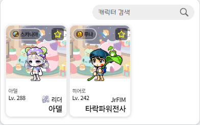

# AS-IS

## 만들고 싶은 기능

`CharacterList` 컴포넌트의 리스트에 추가된 `CharacterCard` 컴포넌트를 클릭하면 해당 캐릭터의 `ToDos` 컴포넌트가 열리도록 하는 기능을 만들고자 했습니다.

## 문제 상황

`CharacterList` 컴포넌트는 리스트에 추가된 `CharacterCard` 컴포넌트들을 가지게 됩니다.





`CharacterCard` 컴포넌트는 우상단에 `ToggleListBtn` 컴포넌트를 가지고 있습니다.  
`ToggleListBtn` 컴포넌트는 클릭을 통해 해당 캐릭터를 리스트에서 추가 또는 제거하는 기능을 수행합니다.

**따라서 버튼을 클릭하면 `ToDos` 컴포넌트가 열리지 않도록 해야했습니다.**

<br />

# Challenge

## 1. `target` 과 `currentTarget`

`e.target` 은 이벤트를 발생시킨 요소를,  
`e.currentTarget` 은 이벤트 핸들러를 사용한 요소를 반환해준다는 점을 이용했습니다.

이를 통해 함수 내에서 `ToggleListBtn` 컴포넌트를 정의하고 필터링했습니다.

```tsx
// CharacterList.tsx
function CharacterList() {
  function openToDoList(e: React.MouseEvent<HTMLElement, MouseEvent>, name: string) {
    const target = e.target as HTMLElement;
    const toggleButton = e.currentTarget.childNodes[0].childNodes[1];

		// 타겟이 토글버튼이 아니면
    if (target !== toggleButton) {
      dispatch(changeToDoOpenState(name)); // dispatch를 통해 상태 변경
    }
  }

  return (
    <div className="charactercard-container">
      {ListedCharacterName.map((key) => (
        <div className="charactercard-wrap" onClick={(e) => openToDoList(e, key)} key={key}>
          <CharacterCard />
        </div>
      ))}
    </div>
  );
}
```

기능이 의도대로 동작하기는 했지만 `ToggleListBtn` 내부 요소인 svg, fill 이 클릭되면 `toggleButton` 이 아니라고 인식됐습니다.

## 2. `contains()`

`ToggleListBtn` 컴포넌트 내부에 어떤 요소가 클릭 되더라도 정상적으로 기능하도록 해야 했습니다.

따라서 `target` 이 `toggleButton` 에 포함되는지 여부를 `contains()` 메서드를 통해 확인 할 수 있었습니다.

```tsx
toggleButton.contains(target);
```

<br>

# TO-BE

클릭한 대상이 토글버튼에 포함되지 않는지 필터링해 정상적으로 기능하도록 했습니다.

```tsx
// CharacterList.tsx
function openToDoList(e: React.MouseEvent<HTMLElement, MouseEvent>, name: string) {
  const target = e.target as HTMLElement;
  const toggleButton = e.currentTarget.childNodes[0].childNodes[1];

	// 클릭한 대상이 토글버튼에 포함되지 않으면
  if (!toggleButton.contains(target)) { 
    dispatch(changeToDoOpenState(name)); // dispatch를 통해 상태 변경
  }
}
```

기능을 구현하며 DOM Element들 간의 상속관계를 파악하고 이를 어떻게 활용해 원하는 기능을 구현할지 많은 생각을 했습니다.

비슷하지면 다른 조건으로 바꿔보면서 상속관계를 활용하는 능력이 향상됐습니다.
